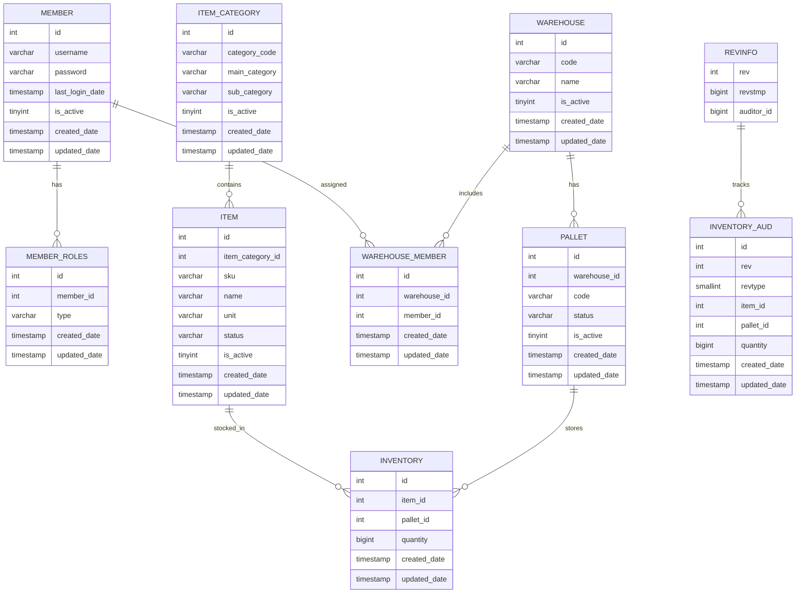
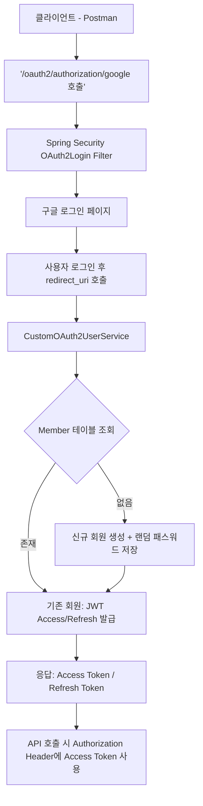

# **Phase 1: 기본 기능 구현 및 성능 챌린지 (SQL 최적화)**

- **과제 1.1: 회원, 상품, 창고 관리 API 구현**
    - **요구사항**: Spring Boot와 Spring Data JPA를 사용해 기본적인 CRUD API를 만듭니다. JWT 기반의 인증과 권한 분리를 적용하세요.
- **과제 1.2: 복합 재고 조회 API 및 SQL 최적화 챌린지**
    - **요구사항**: `GET /stocks/search?productName=...&warehouseId=...`와 같이 상품명, 창고 ID 등 여러 조건을 조합하여
      재고를 검색하는 API를 구현합니다.
    - **챌린지**: 이 API의 SQL 쿼리를 **`EXPLAIN`*으로 분석하고, **JOIN 연산을 최적화**하세요. 적절한 인덱스를 추가하여 쿼리 실행 속도를
      개선하고, 개선 전후의 성능을 기록해 보세요.

# ERD
## [DB Diagram 보러가기](https://dbdiagram.io/d/689af6531d75ee360a2e82c6)

# API 설계

<h3><b>USER API</b></h3>

<table>
  <colgroup>
    <col style="width:8%">
    <col style="width:14%">
    <col style="width:8%">
    <col style="width:18%">
    <col style="width:24%">
    <col style="width:24%">
    <col style="width:4%">
  </colgroup>
  <thead>
    <tr>
      <th>구분</th>
      <th>기능명</th>
      <th>Method</th>
      <th>Endpoint</th>
      <th>Request 예시</th>
      <th>Response 예시</th>
      <th>비고</th>
    </tr>
  </thead>
  <tbody>
    <tr>
      <td>Auth</td>
      <td>로그인</td>
      <td>POST</td>
      <td>/auth/login</td>
      <td>
        

          
보기

          <pre>{
  "email": "test@test.com",
  "password": "1234"
}</pre>
        

      </td>
      <td>
        

          
보기

          <pre>{
  "accessToken": "jwt...",
  "refreshToken": "jwt..."
}</pre>
        

      </td>
      <td>JWT 발행</td>
    </tr>
    <tr>
      <td>Auth</td>
      <td>사용자 인증 (랜덤코드 전송)</td>
      <td>POST</td>
      <td>/auth/verify-code</td>
      <td>
        

          
보기

          <pre>{ "email": "test@test.com" }</pre>
        

      </td>
      <td>
        

          
보기

          <pre>{ "message": "인증코드 발송 완료" }</pre>
        

      </td>
      <td>비밀번호 변경 전</td>
    </tr>
    <tr>
      <td>Auth</td>
      <td>비밀번호 변경</td>
      <td>PUT</td>
      <td>/auth/password</td>
      <td>
        

          
보기

          <pre>{
  "email": "test@test.com",
  "code": "123456",
  "newPassword": "****"
}</pre>
        

      </td>
      <td>
        

          
보기

          <pre>{ "message": "비밀번호 변경 완료" }</pre>
        

      </td>
      <td></td>
    </tr>
    <tr>
      <td>User</td>
      <td>사용자 목록 조회</td>
      <td>GET</td>
      <td>/users?page=0&amp;size=20</td>
      <td>-</td>
      <td>
        

          
보기

          <pre>{
  "content": [
    { "id": 1, "email": "a@test.com", "lastLogin": "2025-08-20" }
  ],
  "page": 0,
  "totalPages": 5
}</pre>
        

      </td>
      <td>페이징</td>
    </tr>
    <tr>
      <td>User</td>
      <td>사용자 상세 조회</td>
      <td>GET</td>
      <td>/users/{id}</td>
      <td>-</td>
      <td>
        

          
보기

          <pre>{
  "id": 1,
  "email": "a@test.com",
  "roles": ["ROLE_USER"],
  "warehouses": ["창고A"]
}</pre>
        

      </td>
      <td></td>
    </tr>
    <tr>
      <td>User</td>
      <td>사용자 생성</td>
      <td>POST</td>
      <td>/users</td>
      <td>
        

          
보기

          <pre>{ "email": "new@test.com", "password": "1234" }</pre>
        

      </td>
      <td>
        

          
보기

          <pre>{ "id": 2, "email": "new@test.com" }</pre>
        

      </td>
      <td>운영 정책에 따라</td>
    </tr>
  </tbody>
</table>

<h3><b>WMS API</b></h3>

<table>
  <colgroup>
    <col style="width:10%">
    <col style="width:14%">
    <col style="width:8%">
    <col style="width:20%">
    <col style="width:22%">
    <col style="width:22%">
    <col style="width:4%">
  </colgroup>
  <thead>
    <tr>
      <th>구분</th>
      <th>기능명</th>
      <th>Method</th>
      <th>Endpoint</th>
      <th>Request 예시</th>
      <th>Response 예시</th>
      <th>비고</th>
    </tr>
  </thead>
  <tbody>
    <tr>
      <td>Warehouse</td>
      <td>창고 등록</td>
      <td>POST</td>
      <td>/warehouses</td>
      <td>
        

보기
<pre>{ "name": "서울창고" }</pre>

      </td>
      <td>
        

보기
<pre>{ "id": 1, "code": "WR16925012345", "name": "서울창고" }</pre>

      </td>
      <td>코드 자동 생성</td>
    </tr>
    <tr>
      <td>Warehouse</td>
      <td>창고 수정</td>
      <td>PUT</td>
      <td>/warehouses/{id}</td>
      <td>
        

보기
<pre>{ "name": "부산창고" }</pre>

      </td>
      <td>
        

보기
<pre>{ "id": 1, "name": "부산창고" }</pre>

      </td>
      <td></td>
    </tr>
    <tr>
      <td>Warehouse</td>
      <td>창고 삭제</td>
      <td>DELETE</td>
      <td>/warehouses/{id}</td>
      <td>-</td>
      <td>
        

보기
<pre>{ "message": "창고 비활성화 처리됨" }</pre>

      </td>
      <td>Soft Delete</td>
    </tr>
    <tr>
      <td>Warehouse</td>
      <td>창고 관리자 추가</td>
      <td>POST</td>
      <td>/warehouses/{id}/managers</td>
      <td>
        

보기
<pre>{ "memberId": 10 }</pre>

      </td>
      <td>
        

보기
<pre>{ "warehouseId": 1, "memberId": 10 }</pre>

      </td>
      <td></td>
    </tr>
    <tr>
      <td>Warehouse</td>
      <td>창고 관리자 삭제</td>
      <td>DELETE</td>
      <td>/warehouses/{id}/managers/{memberId}</td>
      <td>-</td>
      <td>
        

보기
<pre>{ "message": "관리자 권한 해제" }</pre>

      </td>
      <td>추가 제안</td>
    </tr>
    <tr>
      <td>Pallet</td>
      <td>팔렛트 등록</td>
      <td>POST</td>
      <td>/pallets</td>
      <td>
        

보기
<pre>{ "warehouseId": 1, "code": "PL001" }</pre>

      </td>
      <td>
        

보기
<pre>{ "id": 1, "warehouseId": 1, "code": "PL001" }</pre>

      </td>
      <td></td>
    </tr>
    <tr>
      <td>Pallet</td>
      <td>팔렛트 수정</td>
      <td>PUT</td>
      <td>/pallets/{id}</td>
      <td>
        

보기
<pre>{ "code": "PL002" }</pre>

      </td>
      <td>
        

보기
<pre>{ "id": 1, "code": "PL002" }</pre>

      </td>
      <td></td>
    </tr>
    <tr>
      <td>Pallet</td>
      <td>팔렛트 삭제</td>
      <td>DELETE</td>
      <td>/pallets/{id}</td>
      <td>-</td>
      <td>
        

보기
<pre>{ "message": "팔렛트 비활성화 처리됨" }</pre>

      </td>
      <td>Soft Delete</td>
    </tr>
    <tr>
      <td>Pallet</td>
      <td>팔렛트 조회</td>
      <td>GET</td>
      <td>/pallets?warehouseId=1</td>
      <td>-</td>
      <td>
        

보기
<pre>[{ "id": 1, "code": "PL001", "status": "ACTIVE" }]</pre>

      </td>
      <td>검색조건 가능</td>
    </tr>
    <tr>
      <td>ItemCategory</td>
      <td>상품 카테고리 등록</td>
      <td>POST</td>
      <td>/item-categories</td>
      <td>
        

보기
<pre>{ "mainCategory": "식품", "subCategory": "과자" }</pre>

      </td>
      <td>
        

보기
<pre>{ "id": 1, "mainCategory": "식품", "subCategory": "과자" }</pre>

      </td>
      <td></td>
    </tr>
    <tr>
      <td>ItemCategory</td>
      <td>상품 카테고리 수정</td>
      <td>PUT</td>
      <td>/item-categories/{id}</td>
      <td>
        

보기
<pre>{ "subCategory": "스낵" }</pre>

      </td>
      <td>
        

보기
<pre>{ "id": 1, "subCategory": "스낵" }</pre>

      </td>
      <td></td>
    </tr>
    <tr>
      <td>ItemCategory</td>
      <td>상품 카테고리 삭제</td>
      <td>DELETE</td>
      <td>/item-categories/{id}</td>
      <td>-</td>
      <td>
        

보기
<pre>{ "message": "카테고리 비활성화 처리됨" }</pre>

      </td>
      <td>Soft Delete</td>
    </tr>
    <tr>
      <td>ItemCategory</td>
      <td>상품 카테고리 조회</td>
      <td>GET</td>
      <td>/item-categories?mainCategory=식품</td>
      <td>-</td>
      <td>
        

보기
<pre>[{ "id": 1, "mainCategory": "식품", "subCategory": "과자" }]</pre>

      </td>
      <td></td>
    </tr>
    <tr>
      <td>Item</td>
      <td>상품 등록</td>
      <td>POST</td>
      <td>/items</td>
      <td>
        

보기
<pre>{
  "itemCategoryId": 1,
  "sku": "SKU001",
  "name": "초코파이",
  "unit": "EA"
}</pre>

      </td>
      <td>
        

보기
<pre>{ "id": 1, "sku": "SKU001", "name": "초코파이" }</pre>

      </td>
      <td></td>
    </tr>
    <tr>
      <td>Item</td>
      <td>상품 수정</td>
      <td>PUT</td>
      <td>/items/{id}</td>
      <td>
        

보기
<pre>{ "name": "오리온 초코파이" }</pre>

      </td>
      <td>
        

보기
<pre>{ "id": 1, "name": "오리온 초코파이" }</pre>

      </td>
      <td></td>
    </tr>
    <tr>
      <td>Item</td>
      <td>상품 삭제</td>
      <td>DELETE</td>
      <td>/items/{id}</td>
      <td>-</td>
      <td>
        

보기
<pre>{ "message": "상품 비활성화 처리됨" }</pre>

      </td>
      <td>Soft Delete</td>
    </tr>
    <tr>
      <td>Item</td>
      <td>상품 목록 조회</td>
      <td>GET</td>
      <td>/items?categoryId=1&amp;page=0&amp;size=10</td>
      <td>-</td>
      <td>
        

보기
<pre>{
  "content": [{ "id": 1, "sku": "SKU001", "name": "초코파이" }],
  "page": 0,
  "totalPages": 1
}</pre>

      </td>
      <td>페이징</td>
    </tr>
    <tr>
      <td>Item</td>
      <td>상품 단건 조회</td>
      <td>GET</td>
      <td>/items/{id}</td>
      <td>-</td>
      <td>
        

보기
<pre>{ "id": 1, "sku": "SKU001", "name": "초코파이", "status": "ACTIVE" }</pre>

      </td>
      <td></td>
    </tr>
    <tr>
      <td>Inventory</td>
      <td>입고</td>
      <td>POST</td>
      <td>/inbounds</td>
      <td>
        

보기
<pre>{ "itemId": 1, "palletId": 5, "quantity": 100 }</pre>

      </td>
      <td>
        

보기
<pre>{ "eventId": "kafka-offset-123", "status": "PUBLISHED" }</pre>

      </td>
      <td>Kafka 이벤트 발행</td>
    </tr>
    <tr>
      <td>Inventory</td>
      <td>출고</td>
      <td>POST</td>
      <td>/outbounds</td>
      <td>
        

보기
<pre>{ "itemId": 1, "palletId": 5, "quantity": 50 }</pre>

      </td>
      <td>
        

보기
<pre>{ "eventId": "kafka-offset-124", "status": "PUBLISHED" }</pre>

      </td>
      <td>Kafka 이벤트 발행</td>
    </tr>
  </tbody>
</table>

# 로그인 프로세스 정리

