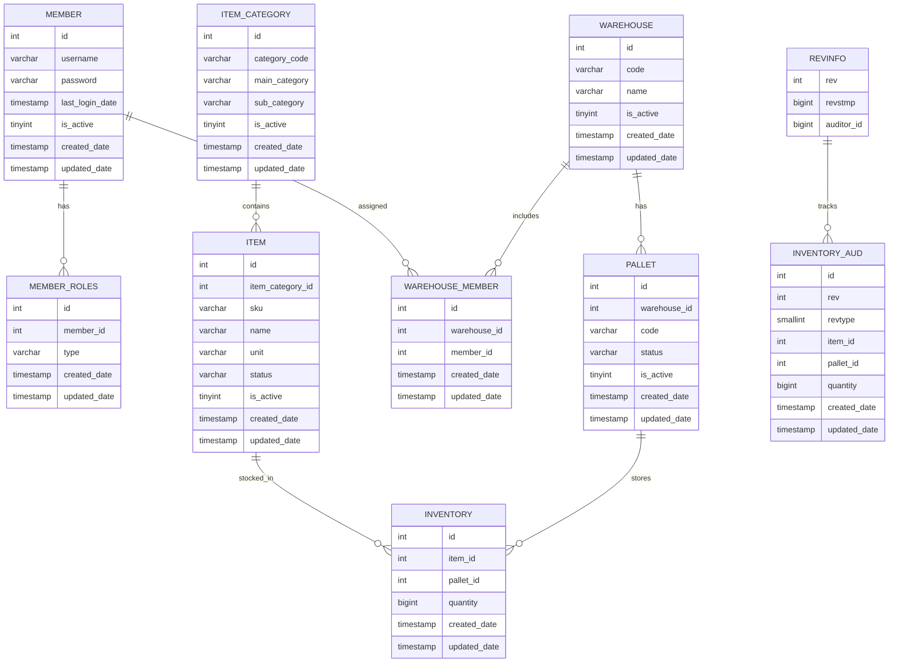
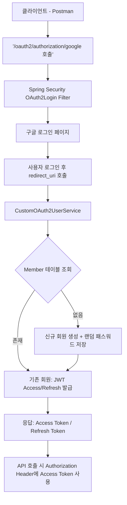

# **Phase 1: 기본 기능 구현 및 성능 챌린지 (SQL 최적화)**

- **과제 1.1: 회원, 상품, 창고 관리 API 구현**
    - **요구사항**: Spring Boot와 Spring Data JPA를 사용해 기본적인 CRUD API를 만듭니다. JWT 기반의 인증과 권한 분리를 적용하세요.
- **과제 1.2: 복합 재고 조회 API 및 SQL 최적화 챌린지**
    - **요구사항**: `GET /stocks/search?productName=...&warehouseId=...`와 같이 상품명, 창고 ID 등 여러 조건을 조합하여
      재고를 검색하는 API를 구현합니다.
    - **챌린지**: 이 API의 SQL 쿼리를 **`EXPLAIN`*으로 분석하고, **JOIN 연산을 최적화**하세요. 적절한 인덱스를 추가하여 쿼리 실행 속도를
      개선하고, 개선 전후의 성능을 기록해 보세요.

# ERD
## [DB Diagram 보러가기](https://dbdiagram.io/d/689af6531d75ee360a2e82c6)

# API 설계

** USER API

|  구분  |       기능명        | Method |       Endpoint        |                             Request 예시                              |                                            Response 예시                                             |    비고     |
|:----:|:----------------:|:------:|:---------------------:|:-------------------------------------------------------------------:|:--------------------------------------------------------------------------------------------------:|:---------:|
| Auth |       로그인        |  POST  |      /auth/login      |          { "email": "test@test.com", "password": "1234" }           |                       { "accessToken": "jwt...", "refreshToken": "jwt..." }                        |  JWT 발행   |
| Auth | 사용자 인증 (랜덤코드 전송) |  POST  |   /auth/verify-code   |                    { "email": "test@test.com" }                     |                                    { "message": "인증코드 발송 완료" }                                     | 비밀번호 변경 전 |
| Auth |     비밀번호 변경      |  PUT   |    /auth/password     | { "email": "test@test.com", "code":"123456", "newPassword":"****" } |                                    { "message": "비밀번호 변경 완료" }                                     |           |
| User |    사용자 목록 조회     |  GET   | /users?page=0&size=20 |                                  -                                  | { "content": [{ "id":1,"email":"a@test.com","lastLogin":"2025-08-20" }], "page":0,"totalPages":5 } |    페이징    |
| User |    사용자 상세 조회     |  GET   |      /users/{id}      |                                  -                                  |           { "id":1, "email":"a@test.com", "roles":["ROLE_USER"], "warehouses":["창고A"] }            |           |
| User |      사용자 생성      |  POST  |        /users         |            { "email":"new@test.com", "password":"1234" }            |                                 { "id":2, "email":"new@test.com" }                                 | 운영 정책에 따라 |

** WMS API

|      구분      |    기능명     | Method |               Endpoint               |                             Request 예시                             |                                  Response 예시                                   |      비고      |
|:------------:|:----------:|:------:|:------------------------------------:|:------------------------------------------------------------------:|:------------------------------------------------------------------------------:|:------------:|
|  Warehouse   |   창고 등록    |  POST  |             /warehouses              |                         { "name":"서울창고" }                          |               { "id":1, "code":"WR16925012345", "name":"서울창고" }                |   코드 자동 생성   |
|  Warehouse   |   창고 수정    |  PUT   |           /warehouses/{id}           |                         { "name":"부산창고" }                          |                            { "id":1,"name":"부산창고" }                            |              |
|  Warehouse   |   창고 삭제    | DELETE |           /warehouses/{id}           |                                 -                                  |                          { "message":"창고 비활성화 처리됨" }                           | Soft Delete  |
|  Warehouse   | 창고 관리자 추가  |  POST  |      /warehouses/{id}/managers       |                         { "memberId":10 }                          |                       { "warehouseId":1, "memberId":10 }                       |              |
|  Warehouse   | 창고 관리자 삭제  | DELETE | /warehouses/{id}/managers/{memberId} |                                 -                                  |                           { "message":"관리자 권한 해제" }                            |    추가 제안     |
|    Pallet    |   팔렛트 등록   |  POST  |               /pallets               |                { "warehouseId":1, "code":"PL001" }                 |                   { "id":1,"warehouseId":1,"code":"PL001" }                    |              |
|    Pallet    |   팔렛트 수정   |  PUT   |            /pallets/{id}             |                         { "code":"PL002" }                         |                           { "id":1,"code":"PL002" }                            |              |
|    Pallet    |   팔렛트 삭제   | DELETE |            /pallets/{id}             |                                 -                                  |                          { "message":"팔렛트 비활성화 처리됨" }                          | Soft Delete  |
|    Pallet    |   팔렛트 조회   |  GET   |        /pallets?warehouseId=1        |                                 -                                  |                  [{"id":1,"code":"PL001","status":"ACTIVE"}]                   |   검색조건 가능    |
| ItemCategory | 상품 카테고리 등록 |  POST  |           /item-categories           |            { "mainCategory":"식품", "subCategory":"과자" }             |               { "id":1,"mainCategory":"식품","subCategory":"과자" }                |              |
| ItemCategory | 상품 카테고리 수정 |  PUT   |        /item-categories/{id}         |                       { "subCategory":"스낵" }                       |                         { "id":1,"subCategory":"스낵" }                          |              |
| ItemCategory | 상품 카테고리 삭제 | DELETE |        /item-categories/{id}         |                                 -                                  |                         { "message":"카테고리 비활성화 처리됨" }                          | Soft Delete  |
| ItemCategory | 상품 카테고리 조회 |  GET   |   /item-categories?mainCategory=식품   |                                 -                                  |               [{"id":1,"mainCategory":"식품","subCategory":"과자"}]                |              |
|     Item     |   상품 등록    |  POST  |                /items                | { "itemCategoryId":1, "sku":"SKU001", "name":"초코파이", "unit":"EA" } |                    { "id":1,"sku":"SKU001","name":"초코파이" }                     |              |
|     Item     |   상품 수정    |  PUT   |             /items/{id}              |                       { "name":"오리온 초코파이" }                        |                          { "id":1,"name":"오리온 초코파이" }                          |              |
|     Item     |   상품 삭제    | DELETE |             /items/{id}              |                                 -                                  |                          { "message":"상품 비활성화 처리됨" }                           | Soft Delete  |
|     Item     |  상품 목록 조회  |  GET   |  /items?categoryId=1&page=0&size=10  |                                 -                                  | { "content":[{"id":1,"sku":"SKU001","name":"초코파이"}], "page":0,"totalPages":1 } |     페이징      |
|     Item     |  상품 단건 조회  |  GET   |             /items/{id}              |                                 -                                  |           { "id":1,"sku":"SKU001","name":"초코파이","status":"ACTIVE" }            |              |
|  Inventory   |     입고     |  POST  |              /inbounds               |             { "itemId":1,"palletId":5,"quantity":100 }             |             { "eventId":"kafka-offset-123","status":"PUBLISHED" }              | Kafka 이벤트 발행 |
|  Inventory   |     출고     |  POST  |              /outbounds              |             { "itemId":1,"palletId":5,"quantity":50 }              |             { "eventId":"kafka-offset-124","status":"PUBLISHED" }              | Kafka 이벤트 발행 |

# 로그인 프로세스 정리

